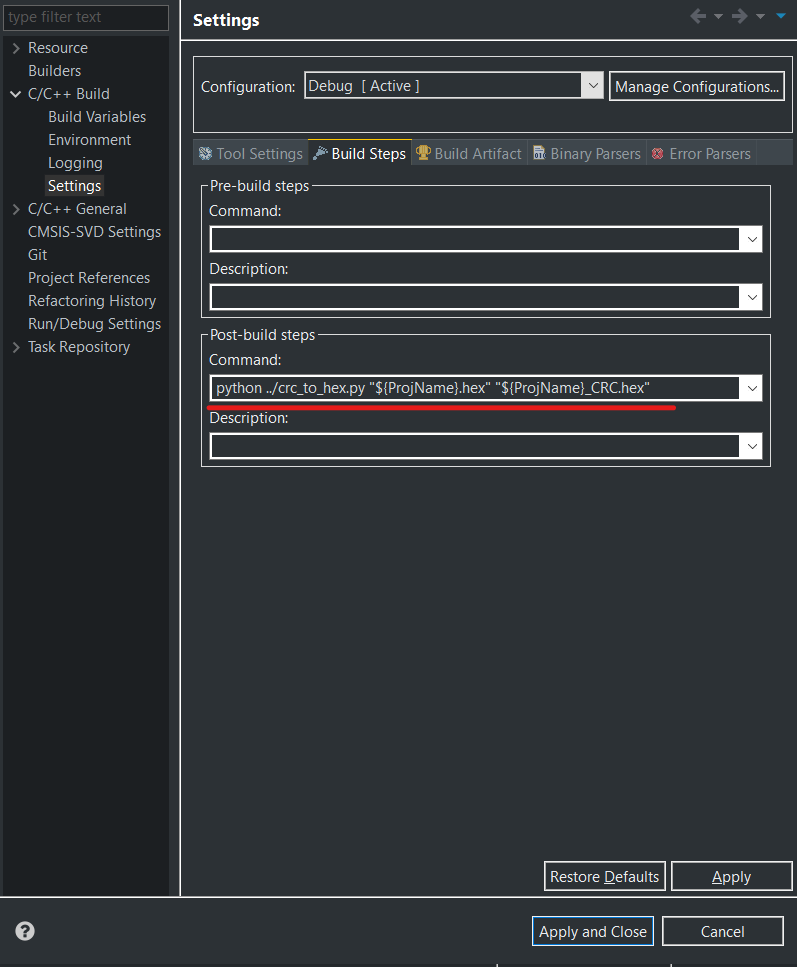
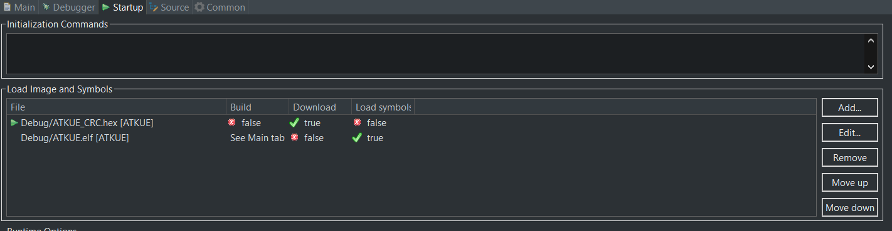

# CRC_To_HEX_Py

Скрипт предназначен для вставки контрольной суммы CRC16 в конец hex файла прошивки для последующего самотестирования кода во FLASH памяти микроконтроллера.
Скрипт создан для среды разработки STM32CubeIDE.

Проект, который являлся исходным материалом для данного скрипта: https://github.com/ethanhuanginst/STM32CubeIDE-Workshop-2019/tree/master/hands-on/06_F746-DISCO-CRC

## Подготовка (для Windows)

1. Скачать и установить интерпретатор Python3 (при установке доабвить исполняемый файл python в переменную среды Path);
2. Разместить файл crc_to_hex.py и srec_cat.exe в корневом каталоге проекта STM32CubeIDE;

## Настройка выполнения скрипта

1. Открыть проект STM32CubeIDE;
2. Нажать правой кнопкой мыши на проект и выбрать Propierties;
3. Открыть раздел C/C++ Build->Settings вкладка Build Steps;
4. В поле "Command:" раздела "Post-build steps" вписать строку:

```
python ../crc_to_hex.py "${ProjName}.hex" "${ProjName}_CRC.hex"
```



Далее после компиляции проекта будет создаваться Hex файл прошивки с контрольной суммой в конце.

## Настройка загрузки Hex файла с контрольной суммой при отладке

1. Создать отладочную конфигурацию и зайти в раздел Startup;
2. В поле Load Image and Symbols необходимо добавить новую строку с настройкой на Hex файл с контрольной суммой;
3. Далее настройки произвести как на примере ниже:



## Алгоритм вычисления CRC16 программой srec_cat

Используемый полином: 0x1021 
```
X^16 + X^12 + X^5 + 1
```
Начальное значение контрольной суммы: 0x1D0F

Функция на Си:

```
uint16_t Crc16(uint8_t *pcBlock, uint32_t len)
{
    uint16_t crc = 0x1D0F;
    uint8_t i;

    while (len--)
    {
        crc ^= *pcBlock++ << 8;

        for (i = 0; i < 8; i++)
            crc = crc & 0x8000 ? (crc << 1) ^ 0x1021 : crc << 1;
    }
    return crc;
}
```

